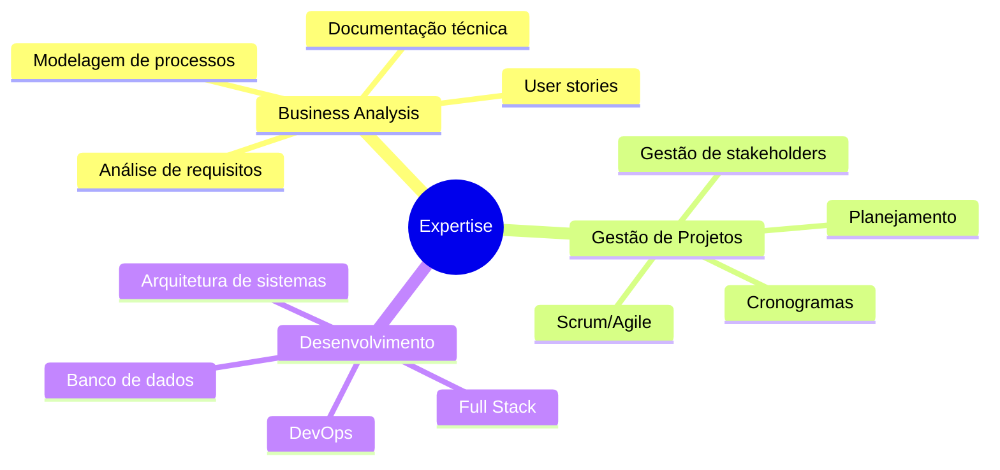

# 👋 Olá! Bem-vindo ao meu GitHub

  
  

  

    
    
    
  

---

## 🧑🏻‍💻 Sobre Mim

Sou **Business Analyst** na **Diebold Nixdorf** com formação em **Tecnologia da Informação pela UFMS** e sólida experiência em desenvolvimento. Atuo na interseção entre negócio e tecnologia, transformando dados em insights acionáveis e requisitos em soluções efetivas.

Minha trajetória como desenvolvedor me dá uma visão única para análise de sistemas, permitindo não apenas entender as necessidades do negócio, mas também avaliar viabilidade técnica e propor soluções otimizadas. **Estou em transição de carreira focado em Gestão de Projetos e Product Management.**

* 💼 **Atualmente:** Business Analyst na **Diebold Nixdorf**
* 🎯 **Próximos Passos:** Gerente de Projetos | Product Owner (PO) | Product Manager (PM)
* 📊 **Especialidades:** Análise de negócios, Levantamento de requisitos, Análise de dados, Metodologias ágeis, Governança de TI
* 💻 **Background Técnico:** Full Stack Development, Mobile, Database
* 🎓 **Formação:** Tecnologia da Informação - UFMS (Universidade Federal de Mato Grosso do Sul)

---

## 💼 Áreas de Atuação

```mermaid
mindmap
  root((Expertise))
    Business Analysis
      Análise de requisitos
      Modelagem de processos
      User stories
      Documentação técnica
    Gestão de Projetos
      Scrum/Agile
      Planejamento
      Gestão de stakeholders
      Cronogramas
    Desenvolvimento
      Full Stack
      Arquitetura de sistemas
      DevOps
      Banco de dados
```

-----

## 🚀 Ecossistema de gestão e análise

Minhas competências de análise, gestão e produto organizadas para fácil visualização.

| Business Analysis | Metodologias & Frameworks | Ferramentas de Gestão |
| :--- | :--- | :--- |
|                 |              |                      |

-----

## 🛠️ Stack técnico

Meu background como desenvolvedor me permite ter um diálogo técnico profundo com as equipes de engenharia.

<strong>Frontend</strong>

 

<strong>Backend</strong>

 

<strong>Database & DevOps</strong>

 

-----
