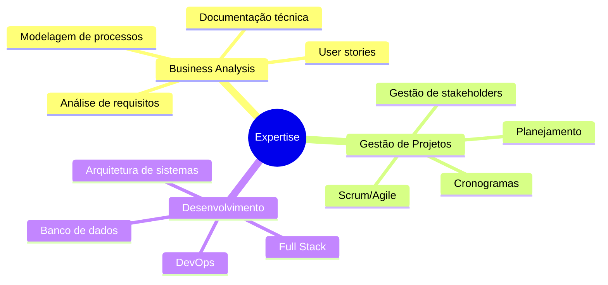

# 👋 Olá! Bem-vindo ao meu GitHub

  
  (https://git.io/typing-svg)
  
  
  
  

---

## 🧑🏻‍💻 Sobre Mim

Sou **Business Analyst** na **Diebold Nixdorf** com formação em **Tecnologia da Informação pela UFMS** e sólida experiência em desenvolvimento. Atuo na interseção entre negócio e tecnologia, transformando dados em insights acionáveis e requisitos em soluções efetivas.

Minha trajetória como desenvolvedor me dá uma visão única para análise de sistemas, permitindo não apenas entender as necessidades do negócio, mas também avaliar viabilidade técnica e propor soluções otimizadas. **Estou em transição de carreira focado em Gestão de Projetos e Product Management.**

- 💼 **Atualmente:** Business Analyst na **Diebold Nixdorf**
- 🎯 **Próximos Passos:** Gerente de Projetos | Product Owner (PO) | Product Manager (PM)
- 📊 **Especialidades:** Análise de negócios, Levantamento de requisitos, Análise de dados, Metodologias ágeis, Governança de TI
- 💻 **Background Técnico:** Full Stack Development, Mobile, Database
- 🎓 **Formação:** Tecnologia da Informação - UFMS (Universidade Federal de Mato Grosso do Sul)

---

## 💼 Áreas de Atuação

```mermaid
mindmap
  root((Expertise))
    Business Analysis
      Análise de requisitos
      Modelagem de processos
      User stories
      Documentação técnica
    Gestão de Projetos
      Scrum/Agile
      Planejamento
      Gestão de stakeholders
      Cronogramas
    Desenvolvimento
      Full Stack
      Arquitetura de sistemas
      DevOps
      Banco de dados
```

---

### 🎯 Competências em Business Analysis

### 📊 Metodologias e Frameworks

### Ferramentas de Gestão

### Product Management

---

## 🛠️ Stack Técnico

### Frontend

### Backend

### Database & Cloud

---

## 📊 Estatísticas do GitHub

  
  

---

## 📈 Gráfico de Atividade

  
  

---

  
  
  
  

---
